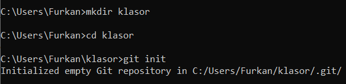
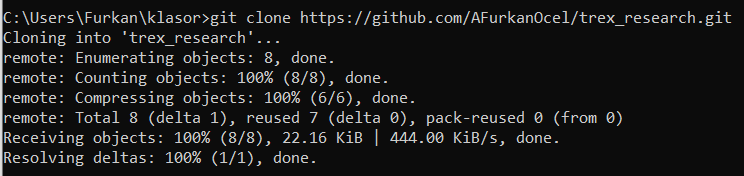
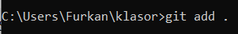
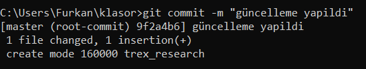

**1\. Modern Yazılım Geliştirme Paketleri**

**Git nedir?**

Git; Yazılım projelerinde yapılan değişiklikleri takip etmeyi ve gerektiğinde kodun önceki hallerine dönmeyi sağlar. Bu sayede kod güvence altına alınır. Ayrıca ekip halinde proje geliştirebilmeyi sağlar. Ekip üyeleri projeyi daha düzenli bir şekilde geliştirebilir.

**Anahtar Kelimeler:** Kod takibi, Kontrollü değişiklikler, Ekip Çalışması

**Yorum:** Yazılım projelerinde yapılan değişiklikleri takip etmeyi sağlar, kodun eski sürümlerini kaydeder ve istenildiğinde eski sürümlere geçiş yapılmasını sağlar. O nedenle Git vazgeçilmez bir sistemdir.

**GitHub nedir?**
**Git ile takip edilen yazılım projelerinin internet üzerinden saklanmasını, paylaşılmasını ve ekipler arasında iş birliği yapılmasını sağlayan bir platformdur. Proje dosyalarının yedeklenmesine olanak tanır ve geliştiricilerin kod üzerinde birlikte çalışmasını kolaylaştırır. Ayrıca kod gözden geçirme ve hata takibi gibi özellikler sunarak proje yönetimini daha verimli hale getirir.

**Anahtar Kelimeler:** Kod takibi, Ekip çalışması, Depolama

**Yorum:** Değişiklikleri takip etmeyi sağlayan bir sistem olan Git’in çevrim içi kullanılmasını sağlayan platformdur.

**Temel Git Komutları**

**init:** Bir klasörümüz var ve bu klasördeki değişiklikleri git ile takip etmek istiyoruz. Bunun için init kullanırız.  
Aşağıdaki komut örneğinde mkdir ile klasor isimli bir klasör oluşturduk ve cd komutu ile klasöre yönlendik, bu klasörün içindeyken git init yazarak bu klasörü bir git deposuna çevirdik.

**clone:** Dışarıdaki bir depoyu kopyalamak için clone komutunu kullanırız.  
Aşağıdaki komut örneğinde git clone … .git diyerek tarayıcı üzerindeki bir depoyu kopyalamış, yani bilgisayarımıza indirmiş olduk.

**add:** commit işlemi öncesi ekleme, değişiklik yapma vb. için kullanılan komuttur.  
Aşağıdaki komut örneğinde git add … kullanarak bir ekleme işlemi gerçekleştirdik. Burada herhangi bir dosya, klasör vb. adı girmek yerine . yazarak tüm değişiklikleri eklemesini istediğimizi belirttik.  

**commit:** Yaptığımız değişiklikleri git geçmişine kaydeder. Örneğin github üzerinden yapılan değişiklikler commit edilir ve bir commit mesajı yazmamız istenir.  
Aşağıdaki komut örneğinde bu commitleme işlemini komut satırı üzerinden yapmış olduk ve -m “…” yazarak commit mesajımızı da iletmiş olduk. Bu sayede yapılan değişikliklerin takibi daha kolay ve sistematik hale geldi.  

**push:** Kelime anlamı “itmek” olan ve bilişim sistemlerinde ekleme anlamına gelen bir terimdir push’lamak. Yapılan değişiklikleri GitHub gibi bir uzak sunucuya göndermenin son adımıdır push işlemi.

**pull:** Kelime anlamı “çekmek” olan bir terimdir. GitHub gibi uzak bir sunucudaki değişiklikleri bilgisayarımıza çekmemizi sağlar.

**branch:** branch kullanarak yeni bir dal (branch) oluşturuyoruz. O dalda kodu güncelliyoruz, eklemeler, düzeltmeler yapıyoruz, eğer uygun görürsek o dalı projemize entegre ediyoruz. Eğer beklediğimiz gibi olmazsa da o dalı siliyoruz.

**merge:** Dal (branch) kullanarak yaptığmız değişiklikleri diğer dallarla veyahut ana dal ile birleştirken merge kulannıyoruz.

**Merge conflict nedir?**

Farklı dallar oluşturup o dalları birleştirmek hem çok daha esnek hem de çok daha güvenli. Fakat 2 veya daha fazla dalda değişiklik yaptığımız durumda dikkatli olmamız gerekir çünkü eğer değişiklik yapılan bu dallarda çakışma olursa merge conflict yani birleştirme çatışması oluşur.  
Örneğin bir kodumuz var ve kodun içersinde “hello world” yazıyor biz bu koddan (anadal) 2 dal çıkardık. Bir dalda “hello world” yazısını “hello turkiye” ile diğer dal da ise “hello china” yazısı ile değiştirdik. Bu durumda Git hangi daldaki değişikliğin yansıtılması gerektiğine karar veremez.

**Nasıl çözülür?**

Bu çakışma olduğu durumda, Git kullancııya çakışmanın olduğu kısımları gösterir, kullanıcı çakışma olmayacak şekilde istediği düzenlemeyi yapar, bu şekilde sorun çözülmüş olur.

**CI/CD nedir?**

CI (Continuous Integration), sürekli entegrasyon anlamına gelir. Geliştiriciler kodlarını sık aralıklarla ana koda entegre eder, bu sayede olası hatalar erken tespit edilir ve çözülür.

CD ise iki anlamda kullanılır Continuous Delivery ve Continuous Deployment, yani sürekli teslimat ve sürekli yayın. Güncellemelerin hızlı ve güvenli bir şekilde otomatik olarak kullancıya sunulmasını sağlar.

Software Development Life Cycle (SDLC)

**Yazılım Geliştirme Sürecinin Aşamaları**

**Planlama:** Bu aşamada; projenin amacı, kapsamı, ne kadar süreceği, ne kadar bütçe gerekeceği belirlenir. İş takvimi oluşturulur.

**Analiz:** Kullanıcılardan gelen taleplerin analiz edilmesi ve risk analizi yapılır. Gereksinim dökümanı hazırlanır.

**Geliştirme:** Planlamalar ve analizler neticesinde projeye başlanır. Kodlama vb. geliştirme süreçlerine geçilir.

**Test:** Nihai proje veya prototip test edilir. Eksiklikler tespit edilerek düzeltilir. Yazılımın güvvenilirliği ve doğruluğu sağlanır.

**Dağıtım:** Tamamlanan yazılım, kullanıcıya sunulur.

**Bakım:** Yazılım yayımlandıktan sonra güncellemeler ve kullanıcıların dönütleri sonucunda gerekli düzeltmeler yapılır.

**Agile metodolojisi:**

Agile metodolojisi günümüzde en meşhur ve yaygın yazılım geliştirme metedolojisidir. Esnek, tekrarlamalı ve müşteri odaklı bir yapsı vardır. Değişen ihtiyaçlara karşı daha iyi adapte olunmasını sağlar. Esnek olması sebebiyle 6 madde olarak kısıtlamak tam anlamıyla doğru olmasa da genel anlamda döngü şeklinde birbirini takip eden 6 adımdan oluşur.

Planlama: Bu adımda, gereksinim analizi yapılır ve bu doğrultuda plan yapılır, yol haritası çizilir.

Tasarım: Bu adımda, yazılımın mimarsinin belirlenir ve tasarımı yapılır.

Geliştirme: Bu adımda, kodlama yapılır.

Test etme: Bu adımda, kodun doğrulu test edilir, eksiklikleri belirlenerek düzeltilir.

Yayınlama: Bu adımda, yazılım kullanıma açılır, kullancıya teslim edilir.

Geri bildirim: Bu adımda, kullanıcılardan gelen geri bildirimler alınır ve değerlendirilir.

**Scrum metodolojisi:**

Scrum, Agile prensiplerini uygulamak için geliştirilmiş. Esnek bir proje yönetim framework’üdür. Scrum’un genel prensibi böl ve yönet’tir. Geniş ve karmaşık projeleri daha küçük ve yönetilebilir parçalara bölmeyi amaçlar. Agile felsefesi doğrultusunda, gereksinimler belirlenir, plan yapılır, ürün geliştirlmeye başlanır. Proje sprint denilen daha ufak parçalara bölünür, iş dağılımları yapılır. Ve bu şekilde ilerlenir. Periyodik toplantılar yapılarak iş takibi yapılır. Geliştirlen yazılım kullanıcıya sunulur ve dönütler doğrultusunda geliştirmeler yapılır.

**Kanban metodolojisi:**

Kanban, Scrum metedolojisine benzer bir şekilde, Agile metedolojisini uygulamak için geliştirilmiş bir yöntemdir. Kanban metedolojisi 1940’lı yıllarda Japon otomotiv devi Toyoto’da geliştirilmiştir ve kelime anlamı olarak “işaret kartı” anlamına gelir. Projeyi görselleştirmek amaçlanır. Kanban panosu genel anlamda şu 3 sütundan oluşur.  
\- Yapılacaklar  
\- Yapılıyor  
\- Tamamlandı  
Her iş panoda bir kartla gösterilir. Bu kartlar, ilk olarak yapılacaklar sütununa eklenir, yapımına başlanan işler yapılıyor sütununa geçer ve son olarak tamamlanan işler tamamlandı sütununa eklenir. Kanban metedolojisiyle işler görselleştirilmiş ve takibi daha kolay ve sistematik hale getirilmiş olur.  

**2\. .NET Ekosistemi**

**.Net nedir?** 
C# dilini destekleyen, Visual Studio gibi gelişmiş IDE’lere uyumlu bir yazılım geliştirme platformudur. Farklı türde ve alanlarda yazılım geliştirmeyi kolaylaştırır.

**Tarihçesi:** 14 şubat **2002** yılında .Net Framework 1.0 çıkış yaptı. **2016** yılına gelindiğinde açık kaynaklı ve platform sınırlaması bulunmayan .Net Core çıktı. **2020** yılında .Net Framework’ün ve .Net Core’un birleştiği .Net 5 çıkış yaptı. **2021** yılında ise modern .Net olan .Net 6 çıkış yaptı. **Sonraki yıllarda** .Net 7, .Net 8 gibi daha gelişmiş versiyonları çıkış yaptı.

**Amacı:** Uygulamaların tek bir platform üzerinde hızlı, güvenli ve verimli şekilde geliştirilmesini sağlamak,  
kullanıcılara çoklu dil desteği ve zengin kütüphanler sunarak, kullanıcıların gelişmiş yazılımlar geliştirmesini sağlamak.

**Neden kullanılır:**
1) Platform sınırlaması yoktur. Windows dışındaki sistemlerde de çalışabilir.  
2) Açık kaynaklıdır.  
3) Popüler bir yazılım geliştirme platformu olduğu için kaynak çoktur.  
4) Performansı yüksektir.  
5) Web, mobil, masaüstü vb. farklı alanlarda kullanılabilir.

**.NET Framework, .NET Core ve .NET 7/8+ farkları**

**.NET Framework nedir?**  
2002 yılında Microsoft tarafından çıkarılan bir yazılım geliştirme platformudur. Fakat eski olması, yalnızca windows işletim sisteminde çalışması ve açık kaynaklı olmaması sebebiyle artık tercih edilmemektedir.

**.NET Core nedir?** 
2016 yılında çıkmıştır. Açık kaynaklıdır ve yalnızca windows işletim sisteminde değil, linux ve macOS işletim sistemlerinde de çalışabilir. Güncel uygulamalar için geliştirilmiştir.

**.NET 7/8+ nedir?**  
.NET 7 2022 yılında çıkmıştır, 1 yıl sonra 2023 yılında ise .NET 8 çıkış yapmıştır. .NET’in en gelişmiş versiyonlarıdır. Yüksek performans sağlar ve yeni sistemlere uyumludur.

**Farkları:**

| **Farklar** | .NET Framework | .NET Core | .NET 7/8+ |
| --- | --- | --- | --- |
| Çıkış Tarihi | 2002 | 2016 | 2022 |
| Performans | kötü | orta | iyi |
| Güncellik | eski | mevcut değil | yeni |
| Açık Kaynaklı mı? | hayır | evet | evet |
| Platform | Windows | Windows, Linux, macOS | tüm platformlar |

**Platformlar arası çalışabilir mi? (Windows, Linux, macOS)**

**.NET Framework** yalnızca Windows işletim sisteminde çalıştığı için platformlar arası çalışmayı desteklemez.

**.NET Core** Windows, Linux ve macOS işletim sistemlerine uyumlu olduğu için platformlar arası çalışmayı destekler.

**.NET 7/8+** Windows, Linux ve macOS işletim sistemlerine uyumlu olduğu .NET Core gibi platformlar arası çalışmayı destekler.

**Senkron ve Asenkron Programlama**

**Senkron Programlama:** Bir işlem sırasında o işlem bitene kadar diğer işlemlerin icra etmesi engellenir. Koddaki bir satırda bekleme işlemi vb. bir durum meydana geldiğinde diğer satırlara geçmeden orada bekler, bu nedenle büyük bir zaman kaybı yaşanır ve bazı programlar donmuş gibi görünebilir.

|     | **Senkron** | **Asenkron** |
| --- | --- | --- |
| **Çalışma şekli** | Bir sonraki işleme geçmeden, mevcut işlemin bitmesini bekler | mevcut işlem yürütülürken, bir sonraki işleme geçebilir |
| **Kullanım alanı** | basit işlemler | ağ, veri tabanı, dosya işlemleri gibi önemli işlemler |
| **Performans** | düşük | yüksek |
| **Donma** | olabilir | akıcıdır |

**Asenkron Programlama:** Bir işlem sırasında diğer işlemlerde yürüyülebilir. Koddaki bir satırda bekleme işlemi vb. bir durum meydana geldiğinde, diğer satırlara geçer ve bekleme işlemi devam ederken kodun diğer kısımları çalışmaya devam edebilir. Bu nedenel senkron programlamaya göre çok daha avantajlıdır.  

**async:** Bir metodu aenkron olarak tanımlamayı sağlar.

**await:** Asenkron sistemlerde kullanılır. Bir komuta beklemesini söyler. Wait kullanılırsa o komut beklerken diğer komutlar icra edilemez, bu senkron ve tercih edilmeyen bir sistemdir. Await kullanarak o komut beklerken diğer komutların icra edilebilmesini sağlamış oluruz.

**Task:** Genellikle asenkron sistemlerde kullanılan, uzun süren işlemlerde işlemin tamamlanmasını takip etmek için kullanılır.  
Örneğin Task&lt;String&gt; diyerek bu metodun bir iş döndürdüğünü ve sonucunun string olduğunu söyler, daha doğru bir şekilde ifade etmek gerekirse garanti eder.

**ConfigureAwait:** UI Thread, kullanıcı arayüzünü yöneten ana iş parçacığıdır. Ekranda görülen tüm butonlar, metinler vb. UI Thread üzerinden yönetilir. UI Thread aynı anda yalnızca bir işi yerine getirebilir. Bu nedenle await kullanak bu kullanıcı arayüzü bulunan istemlerde önemlidir. Bunun yanında ConfigureAwait(false) kullanarak UI Thread e dönmene gerek yok, gördüğün işlemleri yürütmeye devam edebilirsin diyoruz. Bu kullanıcı arayüzü olan sistemlerde tercih edilmez çünkü kullancılar açısından donmalar meydana gelebilir. Fakat kullanıcı arayüzü bulunmayan sistemlerde gereksiz yere UI Thread’e dönmeyi engeller, bu sayede de performansı artırmış olur.

**arrow function (=>) ifadesinin C#’taki yeri**

JavaScript’teki arrow function (=>) ifadesinin C#’taki karşılığı lambda expression (=>) ’dır. Lambda ifadesi kısa ve isimsiz fonksiyonlar tanımlamak için kullanılır. Aşağıda bir kod örneği ve açıklaması bulunmaktadır.  

Bu kodda Func&lt;int,int,int&gt; diyerek int tipinde 2 değer alıp int sonuç döndüren bir fonksiyon tanımladık ve a ile b değişkenlerini alan topla değişkeninin ardından => kullanarak isimsiz bir fonksiyon oluşturduk, ve sonuç olarak a+b işleminin sonucunu döndürdük. Bir alt satırda ise bu sonucu konsola yazdırdık.

**3\. Backend Geliştirme Temelleri**

**Backend nedir?**

Backend, bir yazılım uygulamasının arka planda çalışan kısmıdır. Kulannıcıların gördüğü kısımlar frontendi ilgilendirir. Veritabanı sistemleri ve kontroller, API ve Sunucu taraflı işlemler gibi görevleri kapsar.  

**Frontend ile farkları:**

|     | **Backend** | **Frontend** |
| --- | --- | --- |
| **Çalıştığı yer** | Arka plan | Ön Plan |
| **Görevler** | API, veritabanı, güvenlik | tasarım |
| **Teknolojiler** | Node.js, .NET, Python | HTML, CSS, JavaScript |
| **Çalıştığı yer** | sunucu | tarayıcı |

**Web sunucusu nedir?**  
Web sunucusu, bir web sitesinin kodunu ve verilerini barındıran bir sunucu yazılımıdır. URL, web sunucusunun adresini tutar. Bir URL’ye tıklandığında adres doğrultusunda web sunucusuna yönlendirme yapılır.

**API nedir?**

API (Uygulama Programlama Arayüzü), yazılımlar arası iletişimi sağlayan arayüzdür. İki yazılımın belirli kurallar ve protokoller doğrultusunda birbirleri ile iletişim kurmasını sağlar.

**API türleri:** API türlerini Erişim türlerine göre 4 ve mimarilerine göre 4 olmak üzere 8 başlık altında toplayabiliriz.

**Erişim Türlerine göre API mimarileri**

1) Dahili API

2) Açık API

3) Ortaklık API

4) Bileşik API

  
**Mimarilerine göre API türleri**

1) Rest API

2) SOAP API

3) GraphQL

4) gRPC

**HTTP nedir?**

Web tarayıcısı ile web sunucusu arasındaki iletişimi sağlayan protokoldür. Web adreslerinin başında bulunur.  
Örneğin:  
<https://www.google.com/?hl=tr>

**HTTP metodları:**

**Get:** Sunucudan veri almak için kullanılır.

**Post:** Sunucuya veri göndermek için kullanılır.

**Put:** Mevcut veriyi güncellemek için kullanılır.

**Delete:** Mevcut veriyi silmek için kullanılır.

**RESTful servislerin çalışma mantığı**

Her kaynak için ayrı bir URL vardır. RESTful servislerinin çalışma mantığı http protokolüüzerinden yapılan istekler doğrultusunda istemci ile sunucu arasında kaynak tabanlı bir iletişim kurulmasıdır.

**JSON veri formatı ve kullanım amacı**

Genellikle web uygulamalarında istemci ile sunucu arasında veri alışverişi yapmak için kullanılır. RESTful API’larında kullanılan bir veri formatıdır. Anahtar - değer çiftlerinden oluşur. Farklı sistemler arasındaki veri alışverişini basit ve kolay kılar. Mantığı basittir.

**SOAP ve GraphQL nedir, REST’ten farkları**

SOAP, GraphQL ve Rest istmci ile tarayıcı arasında veri alışverişi sağlamak için kullanılan web servis mimarileridir. SOAP xml tabanlıdır. GraphQL facebook tarafından geliştirlmiştir ve JSON tabanlıdır. Rest ise çoğunlukla JSON tabanlı olmak üzere XML tabanlı da olabilir.

**REST’ten farkları:**

SOAP ve GraphQL de tek bir URL adresi varken, REST mimarisinde ise her kaynak için ayrı URL vardır.

**4\. ASP.NET**

**ASP.NET ve ASP.NET Core nedir? Avantajları, farkları**

**ASP.NET nedir:** ASP.NET .NET Framework tabanlı eski bir web uygulaması geliştirme platformudur, bu nedenle yalnızca Windows üzerinde çalışır.

**ASP.NET Core nedir:** .NET Core, .NET 5/6/7/8+ üzerinde çalışan ASP.NET’in daha gelişmiş versiyonudur. Farklı işletim sistemleri üzerinde çalışabilir. Açık kaynaklıdır.

**Avantajları:**

ASP.NET Core’un ASP.NET’e göre avantajları aşağıdaki gibidir:

1) Performansı yüksektir.

2) Daha günceldir.

3) Yalnızca Windows üzerinde değil, Linux ve macOS gibi işletim sistemleri üzerinde de çalışabilir.

4) MVC ve API yapısı tek yapı altında birleştirilmiştir bu da daha iyi optimizasyon sağlar ve kod tekrarını önler.

5) Açık kaynaklıdır.

**Farkları: Yukarıdaki** ASP.NET Core’un ASP.NET’e göre avantajlarından da görebileceğimiz üzere, ASP.NET Core ASP.NET’e göre pek çok açıdan daha avantajlıdır.

**MVC nedir, ne için kullanılır?**

MVC (Model View Controller), özellikle web geliştirmede kullanılan bir mimari modeldir. Uygulamanın yapısını 3 ayrı katmana ayırır. Bu katmanlar; Model, View ve Controller.

Model katmanı: Uygulamanın modelini, mantığını ve veri yapsını kapsar. Tasarım yapılır, içerik belirlenir. Kurallar bu katmanda tanımlanır. Ayrıca veriler burada tutulur.

View katmanı: Kullanıcıya gösterilen kısımdır. Genellikle HTML, CSS ve JavaScript 3’lüsü kullanılır. Sunum kısmıdır. Frontend alanını kapsar. Kullanıcı tarafından görüntülenen kısım olması sebebiyle önemlidir.

Controller katmanı: Kullanıcı ve sistem arasında arabulucu gibi çalışır. Verileri ileten, kararları alan, girdileri işleyen ve talimatları yönlendiren katmandır. Bilgisayardaki İşlemci’ye benzetilebilir.

**Middleware nedir, nasıl çalışır?**

Middleware’i bir denetleme katmanı olarak ifade edebiliriz. İstemci ve sunucu arasında veri akışını kontrol eder. Kullanıcının yetkili olup olmadığını kontrol eder. Hata tespiti yapar ve bu hataları loglar, yani hataları bir dosyaya kaydeder.

**Worker, Backgorund Job nedir? Farkları**

**Worker nedir?**  
Worker arka planda çalışan bir işçi gibidir. İş kuyruğundaki işleri alır ve tamamlar.

**Background Job nedir?**  
Background job, büyük ve uzun sürecek görevleri uygun şekilde arka planda çalıştırılcak şekilde planlar.

**Farkları:**  
Background job bir işi planlar, worker ise bu işi yürütür.

**Dependency Injection (DI) nedir, neden önemlidir?**

Dependency Injection, bir sınıfın ihtiyaç duyduğu bağımlılıkları, örneğin başka sınıfları veya nesneleri o sınıfın içersinde oluşturmak yerine dışarıdan almasına dayanan bir mimari tasarımdır. Bu hem esneklik sağlar hem de kolay test edilebilirlik sağlar, kod hata verdiğinde, hatanın tespiti ve düzeltilmesi daha kolay hale gelir.

**5\. Veritabanı ve ORM**

**SQL nedir?**

Veri tabanlarında veri çekmek, eklemek ve silmek için kullanılan bir programlama dilidir.

**İlişkisel ve ilişkisel olmayan veri tabanları arasındaki farklar**

İlişkisel veritabanında, veriler satırlar ve sütunlar biçiminde tablolarda tutulur. Tablolar arasında ilişkiler kurulur. MySQL, Oracle gibi veritabanı sistemleri ilişkisel veritabanına örnektir.  
İlişkisel olmayan veritabanında ise veriler dökümanlar halinde, grafikler halinde veya anahtar-değer biçiminde tutulur. Veriler yatay ölçeklenir. MongoDB, Redis gibi veritabanı sistemleri ilişkisel olmayan veritabanına örnektir.

**ORM nedir? Entity Framework Core nedir?**

ORM, Java gibi nesneye yönelik programlama dilleri ile Veri dönüşümünü sağlar.

Entity Framework Core, .NET için geliştirilmiş bir ORM aracıdır. Açık kaynaklıdır ve platformlar arası çalışabilmektedir.

**DbContext nedir?**

DbContext, Entity Framework’un kütüphanesinde bulunur. Veritabanı ile uygulama arasında köprü görevi gören bir sınıftır.

**LINQ nedir? En çok kullanılan LINQ ifadeleri**

LINQ (Language Integrated Query), C# gibi dillerde koleksiyonlar, diziler ve veritabanları üzerinde sorgulama yapmayı sağlayan yapıdır. SQL benzeri bir sözdizimiyle veri filtreleme, sıralama, gruplama ve dönüştürme işlemleri LINQ ifadeleriyle kolayca yapılabilir.

**Code-First ve Database-First yaklaşımı nedir?**

Code-First yaklaşımında önce kod yazılır ardından bu koddan otomatik olarak veritabanı oluşturulur.

Database-First yaklaşımında önce veritabanı oluşturulur ardından bu veritabanından otomatik olarak kod oluşturulur.

**Temel SQL sorguları:**

**SELECT:** Veri çekmek için kullanılır.  
Sorgu örneği: SELECT Furkan FROM Calisanlar WHERE Kat = 2;

**INSERT:** Veri eklemek için kullanılır.  
Sorgu örneği: INSERT INTO Calisanlar (Ad, Yas) VALUES ('Furkan’, 21);

**UPDATE:** Mevcut veriyi güncellemek için kullanılır.  
Sorgu örneği: UPDATE Calisanlar SET Kat = 3 WHERE Ad = 'FURKAN';

**DELETE:** Veri silmek için kullanılır.  
Sorgu örneği: DELETE FROM Calisanlar WHERE Kat = 2;

**6\. Güvenlik ve Performans**

**Authentication vs Authorization nedir?**  

Authentication kimlik doğrulamadır. Kullanıcı adı – şifre, desen çizme, parmak izi ve yüz tanıma ile kullanıcı doğrulama yapar. Bu doğrulamayı veritabanına erişerek yapar, girilen şifre vb. ile veritabanındakinin uyuşup uyuşmadığını kontrol eder.

Authorization ise yetkilendirmedir. Kullanıcının hangi işlemleri yapabileceğini belirler.  
Örneğin; X kullanıcısı A dosyasına veri ekleyebilir fakat veri silemez. Y kullanıcısı ise A dosyasına hem veri ekleyebilir hem de veri ekleyemez.

**JWT (JSON Web Token) nedir, nasıl çalışır?**

JWT’yi web uygulamalarında kullanıcı doğrulama ve yetkilendirme işlemleri için kullanılan bir izin belgesi veya geçici kimlik olarak düşünebiliriz. JWT başlık, veri ve imza olmak üzere 3 kısımdan oluşur.

Başlık, kimlik tipi ve şifreleme algoritması bilgilerini tutar.

Veri, kullanıcı bilgilerini ve yetkilerini tutar.

İmza, başlık ve veri kısımlarının gizli bir anahtar kullanılarak oluşturulan imzasıdır. İmza verinin değiştirlmediğini garanti eder.

**OAuth, OAuth2.0, OpenIddict, OpenID nedir? Aralarındaki ilişki**

OAuth ve OAuth 2.0, kullanıcıların parolalarını paylaşmadan üçüncü taraf uygulamalara belirli kaynaklara erişim izni vermesini sağlayan yetkilendirme protokolleridir. OAuth, ilk sürüm olarak temel bir erişim yetkisi sunarken, OAuth 2.0 daha esnek, güvenli ve yaygın olarak kullanılan geliştirilmiş bir versiyondur. OpenID, kullanıcıların tek hesapla farklı sitelere giriş yapabilmelerini sağlayan bir kimlik doğrulama protokolüdür. OpenIddict, ASP.NET Core uygulamaları için OpenID Connect ve OAuth 2.0 tabanlı bir kimlik ve yetkilendirme sunucusu oluşturmaya yarayan açık kaynaklı bir kütüphanedir. Kendi OAuth/OpenID sağlayıcını kurmak isteyen projeler için esnek ve güvenli bir çözümdür.

**Performans artımı için ne yapılabilir? (AsNoTracking, IAsyncEnumerable, caching, profiling, redis)**

**AsNoTracking():** Entity Framework’te sorgu sonucu izlenmez, sadece okunur işlemler için performansı artırır.

**IAsyncEnumerable:** Verileri belleğe yüklemeden parça parça asenkron olarak işler, kaynak kullanımını azaltır.

**Caching:** Sık kullanılan verileri geçici bellekte tutarak tekrar erişimde hız kazandırır.

**Profiling:** Uygulama içindeki yavaş veya sorunlu noktaları tespit etmeye yarar.

**Redis:** Hızlı ve dağıtık bir önbellekleme sistemiyle yüksek performanslı veri erişimi sağlar.

**OWASP Top 10**

**Web uygulamalarında en yaygın güvenlik açıkları**

**1)** [Broken Access Control](https://owasp.org/Top10/A01_2021-Broken_Access_Control/)

**2)** [Cryptographic Failures](https://owasp.org/Top10/A02_2021-Cryptographic_Failures/)

**3)** [Injection](https://owasp.org/Top10/A03_2021-Injection/)

**4)** [Insecure Design](https://owasp.org/Top10/A04_2021-Insecure_Design/)

**5)** [Security Misconfiguration](https://owasp.org/Top10/A05_2021-Security_Misconfiguration/)

**6)** [Vulnerable and Outdated Components](https://owasp.org/Top10/A06_2021-Vulnerable_and_Outdated_Components/)

**7)** [Identification and Authentication Failures](https://owasp.org/Top10/A07_2021-Identification_and_Authentication_Failures/)

**8)** [Software and Data Integrity Failures](https://owasp.org/Top10/A08_2021-Software_and_Data_Integrity_Failures/)

**9)** [Security Logging and Monitoring Failures](https://owasp.org/Top10/A09_2021-Security_Logging_and_Monitoring_Failures/)

**10)** [Server-Side Request Forgery](https://owasp.org/Top10/A10_2021-Server-Side_Request_Forgery_%28SSRF%29/)

**SQL Injection, XSS, CSRF, Broken Auth gibi başlıkların kısa tanımı**

**SQL Injection:** Veritabanına dayalı uygulamalara saldırmak için kullanılan bir enjeksiyon saldırısıdır. Veritabanına veri eklemek, silmek veya değiştirmek için kullanılabilen kötü amaçlı bir saldırıdır.

**Cross-Site Scripting (XSS):** Kötü niyetli yazılımcılar savunmasız bir web sitesini manipüle ederek kullanıcılara kötü amaçlı kodlar döndürebilir. Örneğin savunmasız bir web sitesine girdiğimizde çerezleri kabul et butonuna tıkladığımızda çerez bilgilerimiz kötü niyetli yazılımcıların eline geçebilir. fetch komutu ile kullanıcının çerezlerde kabul ettiği bilgileri başka sitelere gönderilebilir.

**Cross Site Request Forgery (CSRF):** Kullanıcı üzerinden web sitesine istenilmeyen, risk teşkil edebilecek komutların gönderilmesidir.

**Broken Auth:** Bozuk kimlik doğrulama, web uygulamasındaki kullanıcı girişi vb. güvenlik açıklarını ifade eder. Yetkisiz kullanıcılar sistemi tehlikeye atabilir.

**ASP.NET Core ile alınabilecek önlemler (örnek: model validation, input sanitization)**

**Model Validation:** Boş, çok uzun ve geçersiz mailler reddedilir.

**Input Sanitization:**

**7\. Logging ve Hata Yönetimi**

**Neden loglama yapılır? Log seviyesi nedir?**

Bir yazılımın çalışma esnasında meydana gelen hataları takip eder ve olası hata durumunda kullanıcya bir mesaj olarak döndürür.

**Log seviyesi:** Log mesajlarının önem derecesini belirtir.

**ASP.NET Core'da logging altyapısı**

ASP.NET CORE’da logging, uygulamayı denetler ve hataları yazar. Katmanlı mimariye sahiptir.

**Global exception handling nasıl yapılır?**

Hataların sistemli bir şekilde loglanmasını sağlayan, uygulamada oluşabilecek hataları merkezi bir noktadan kontrol etmek için kullanılır.  
ASP.NET Core’da Global Exception Handling yapmak için en sık kullanılan yöntem Middleware yöntemidir.

**UseExceptionHandler ve ILogger nasıl kullanılır?**

UseExceptionHandler ve ILogger, ASP.NET Core uygulamalarında global hata yakalama ve loglama amacıyla kullanılır.  
UseExceptionHandler, bir middleware olarak yapılandırılır ve uygulama genelinde oluşabilecek beklenmeyen hataları yakalayarak özel hata sayfalarına yönlendirme veya hata çıktısı verme gibi işlemleri merkezi şekilde yönetir.  
ILogger ise bu hataları loglamak için kullanılır ve farklı log seviyelerinde kayıt alarak sistemin izlenmesini sağlar. Bu yapı sayesinde hatalar merkezi olarak yönetilir.

**8\. Yazılım Geliştirme Prensipleri**

**SOLID prensipleri: Her biri için kısa açıklama ve örnek**

5 adet SOLID prensibi vardır. Bunlar:  
**S**ingle Responsibility Principle  
**O**pen/Closed Principle  
**L**iskov Substitution Principle  
**I**nterface Segregation Principle**  
**D**ependency Inversion Principle

**Single Responsibility Principle:** Bir sınıfın bir sorumluluğu olmalı der.

**Open/Closed Principle:** Kodlar geliştirilmeye açık fakat değiştirilmeye kapalı olmalı der.

**Liskov Substitution Principle:** Alt sınıfı gerektiğinde bir üst sınıfın yerine geçebilmeli der.

**Interface Segregation Principle:** İhtiyaçlara yönelik küçük arayüzler kullanılmalı der.

**Dependency Inversion Principle:** Sınıflar somut sınıflara değil, soyutlamalara bağımlı olmalı der.

**Design Patterns: Singleton, Repository, Factory**

Yazılımda sıkça karşılaşılan problemleri çözmek amacıyla geliştirilen çözüm şablonlarıdır.

Singleton pattern: Bir sınıftan yalnızca bir tane nesne oluşturulmasını ve bu nesneye global olarak erişilmesini sağlar.veritabanı işlemleri doğrudan uygulama mantığına yazılmaz bunun yerine Repository sınıfı aracılığıyla yapılır

Repository pattern: Veri erişim işlemlerini uygulamanın geri kalanından soyutlar.

Factory pattern: Nesne oluşturma işlemlerini merkezileştirmek için kullanılır. Bu şablon sayesinde, new kullanarak yeni bir nesne yaratmak yerine, Factory sınıfına erişir ve gerekli nesneleri oluşturur.

**Clean Code nedir, neden önemlidir?**

Clean Code, adı üzerinde karmaşık olmayan Temiz, anlaşılır ve net yazılmış koddur.

Yazılım Mimari Desenleri

**Layered, Clean Architecture, Microservices, Event-Driven, Hexagonal Architecture (Ports & Adapters)**

**Layered Architecture (Katmanlı Mimari)**: Uygulamayı sunum, iş mantığı, veri erişim gibi katmanlara ayırır. Basit yapılı projeler için uygundur, katmanlar arasında net sorumluluk ayrımı sağlar. 
 

**Clean Architecture**: Bağımlılıkların içe doğru olduğu, iş kurallarının merkezde olduğu bir mimaridir. Test edilebilirlik ve sürdürülebilirlik gerektiren karmaşık projelerde tercih edilir. 
 

**Microservices (Mikroservisler)**: Büyük uygulamayı birbirinden bağımsız, küçük servisler olarak parçalara böler. Ölçeklenebilirlik ve bağımsız geliştirme gerekiyorsa uygundur.  

**Event-Driven Architecture (Olay Tabanlı Mimari)**: Sistem bileşenleri olaylara tepki verir ve birbirleriyle olay mesajları üzerinden iletişim kurar. Gevşek bağlı, esnek ve gerçek zamanlı uygulamalarda tercih edilir.  

**Hexagonal Architecture (Ports & Adapters)**: Uygulamanın çekirdeğini dış dünya bağımlılıklarından soyutlar, giriş-çıkış adapterlarıyla iletişim sağlar. Test kolaylığı ve dış sistemlerle entegrasyon gerektiğinde kullanılır.  

**Hangi senaryoda hangi mimari tercih edilir?**

**Layered Architecture: Küçük ve basit ölçekli uygulamalarda tercih edilir.**

**Clean Architecture**: Uzun vadeli test edilebilirliğie ihtiyaç duyan uygulamalarda tercih edilir.

**Microservices: Dağıtılmış, bağımsız geliştirlmesi gereken modüllerin olduğu uygulamalarda tercih edilir.**

**Event-Driven Architecture: Asenkron ve esnek mesajlaşmanın gerektiği uygulamalarda tercih edilir.**

**Hexagonal Architecture: Dış sistemlerle sık entegrasyon gerektiren uygulamalarda tercih edilir.**

**Katmanlı Mimari (Layered Architecture)**

**Presentation, Business, Data Access katmanları**

Presentation layer (Sunum katmanı), kullanıcı ile doğrudan etkileşim kuran katmandır.

Business layer (İş katmanı), kararların alındığı ve iş kurallarının yer aldığı katmandır.

Data Access layer (Veri erişim katmanı), veritabanı ile iletişimi sağlayan katmandır.

**Service & Repository pattern**

**Service pattern:** İş kurallarını ve uygulamanın mantığını içeren yönetici katmandır.

**Repository pattern:** Veritabanı ile ilgili işlemler bu katmanda yapılır.

Clean Architecture

**Domain, Application, Infrastructure, API katmanları**

Clean Architecture’da uygulama dört temel katmana ayrılır:  
Domain katmanı, iş kurallarını ve varlıkları içerir, sistemin merkezdeki katmanıdır. Application katmanı, kullanım senaryolarını ve iş akışlarını yönetir, domain’i kullanarak uygulama mantığını oluşturur. Infrastructure katmanı, veritabanı, dosya sistemi veya dış servislerle iletişimi sağlayan teknik detayları barındıran katmandır. En dışta yer alan API katmanı ise kullanıcıdan gelen istekleri alır ve uygulamanın iç katmanlarına ileterek yanıtı döner.

**Bağımlılıkların dışa akması ilkesi**

Clean architecture, bağımlılıkların dışa akması ilkesine örnektir. En iç katmanda bulunan iş kuralları, dış katmanlara bağlı değildir. Fakat dış katmanlar, iç katmanlardaki soyutlamalara bağımlıdır.

**9\. Kaynakça**

<https://git-scm.com/book/tr/v2/Ba%C5%9Flang%C4%B1%C3%A7-Git-Nedir%3F>

<https://odayibasi.medium.com/git-komutlar%C4%B1-ve-kullan%C4%B1m%C4%B1-51ec0c07a434>

<https://coderspace.io/sozluk/github/>

<https://aguayo.co/en/blog-aguayo-user-experience/agile-methodology-in-ux/>

<https://www.wowslides.com/users/lalesaslan/projects/Scrum-Proje-Yonetim-Metodolojisi>

<https://en.wikipedia.org/wiki/Kanban_%28development%29>

<https://www.alastyr.com/blog/microsoft-net-framework-nedir/>

<https://onerbilisim.com/blog/net-core-nedir-tarihcesi-ve-ozellikleri/>

<https://www.linkedin.com/pulse/what-net-5-means-you-gaurav-aggarwal/>

<https://www.codeproject.com/Articles/5333587/NET-6-New-Features?PageFlow=Fluid>

<https://pvs-studio.com/en/blog/posts/csharp/1009/>

<https://mediumturkiye.com/net-8i-hemen-kullanman%C4%B1z-i%CC%87%C3%A7in-10-neden-3cc2b995ef17>

<https://www.mshowto.org/mvc-nedir-mvc-yapisi-ve-ozellikleri.html>

<https://mustafaonurtasdemirr.medium.com/middleware-nedir-ecdef1409fa>

<https://caylakyazilimci.com/post/api-nedir>

<https://www.technopat.net/2024/08/30/iliskisel-ve-iliskisel-olmayan-veritabani-nedir-farklari-nelerdir/>

<https://medium.com/kodluyoruz/orm-nedir-orm-ara%C3%A7lar%C4%B1-ve-yakla%C5%9F%C4%B1mlar%C4%B1-nelerdir-37af94ee873c>

<https://github.com/resources/articles/devops/ci-cd>

<https://www.atlassian.com/git/tutorials/using-branches/merge-conflicts>

<https://www.komtas.com/post/yazilim-gelistirme-yasam-dongusu-sdlc-modelleri-nelerdir>

<https://www.techcareer.net/blog/javascript-te-asenkron-ve-senkron-programlama-nasil-kullanilir>

<https://www.infotechacademy.com.tr/blog/front-end-ve-back-end-nedir>

[https://tr.wikipedia.org/wiki/Web_sunucusu#:~:text=Web%20sunucusu%2C%20HTTP%20(Hypertext%20Transfer,ve%20altyap%C4%B1%20donan%C4%B1m%C4%B1n%C4%B1%20ifade%20eder](https://tr.wikipedia.org/wiki/Web_sunucusu#:~:text=Web%20sunucusu%2C%20HTTP%20%28Hypertext%20Transfer,ve%20altyap%C4%B1%20donan%C4%B1m%C4%B1n%C4%B1%20ifade%20eder).

<https://aws.amazon.com/tr/what-is/api/>

<https://www.mikro.com.tr/api-nedir/>

<https://medium.com/@dilarauluturhan/webin-temel-i%CC%87leti%C5%9Fim-arac%C4%B1-http-protokol%C3%BC-e9f5ecd3de81>

<https://www.oracle.com/tr/database/what-is-json/>

<https://learn.microsoft.com/tr-tr/aspnet/overview>

<https://aspnetboilerplate.com/Pages/Documents/Background-Jobs-And-Workers>

<https://bluemarkacademy.com/yazilim-guvenligi-nedir-ve-gunumuzde-neden-bu-kadar-onemlidir/>

<https://bulutistan.com/blog/veri-tabani-yonetim-sistemi-nedir/>

<https://refactoring.guru/design-patterns>

<https://www.patika.dev/blog/solid-prensipleri-nedir>

<https://learn.microsoft.com/en-us/dotnet/core/extensions/logging?tabs=command-line>

<https://www.atakdomain.com/blog/sql-sorgu-ornekleri>

<https://blog.codacy.com/what-is-clean-code#:~:text=Clean%20code%20is%20a%20term,Agile%20Software%20Craftsmanship%22%20in%202008>.

<https://www.devart.com/dotconnect/what-is-entity-framework-core.html>

<https://learn.microsoft.com/tr-tr/dotnet/api/system.data.entity.dbcontext?view=entity-framework-6.2.0>

<https://www.reddit.com/r/csharp/comments/1en77j3/what_is_language_integrated_query_l%C4%B1nq_and_what/?tl=tr>

<https://bidb.itu.edu.tr/seyir-defteri/blog/2013/09/06/linq-sorgulama-%C3%B6rnekleri>

<https://www.entityframeworktutorial.net/code-first/what-is-code-first.aspx>

<https://miuul.com/blog/entity-framework-database-first-model-first-code-first>

<https://idemarket.com.tr/blog/yazilim/en-cok-kullanilan-yazilim-mimarileri/>

<https://sezeromer.com/c-katmanli-mimari/>

<https://serkanerip.medium.com/clean-architecture-temiz-mimari-nedir-22961b7d389b>

<https://www.turing.com/blog/software-architecture-patterns-types>

<https://www.jwt.io/introduction>

<https://www.onelogin.com/learn/authentication-vs-authorization#:~:text=Authentication%20and%20authorization%20are%20two,authorization%20determines%20their%20access%20rights>.

<https://konghq.com/blog/learning-center/what-is-oauth>

<https://secromix.com/blog/owasp-top-10-nedir-ve-bu-risklerden-nasil-kacinilir/>

<https://owasp.org/www-project-top-ten/>

<https://medium.com/devopsturkiye/katmanl%C4%B1-mimari-nedir-84d097b674c2>

<https://medium.com/@sakcay415/clean-architecture-temiz-mimari-nedir-df27b237c4e2>

<http://www.mustafabas.me/tr/mikroservis-mimarisi-nedir-avantajlari-dezavantajlari-nelerdir--b-1006>

<https://fatihsoysal.com/blog/olay-tabanli-mimari-ornek-proje-incelemesi-eticaret/>

<https://www.geeksforgeeks.org/system-design/hexagonal-architecture-system-design/>
